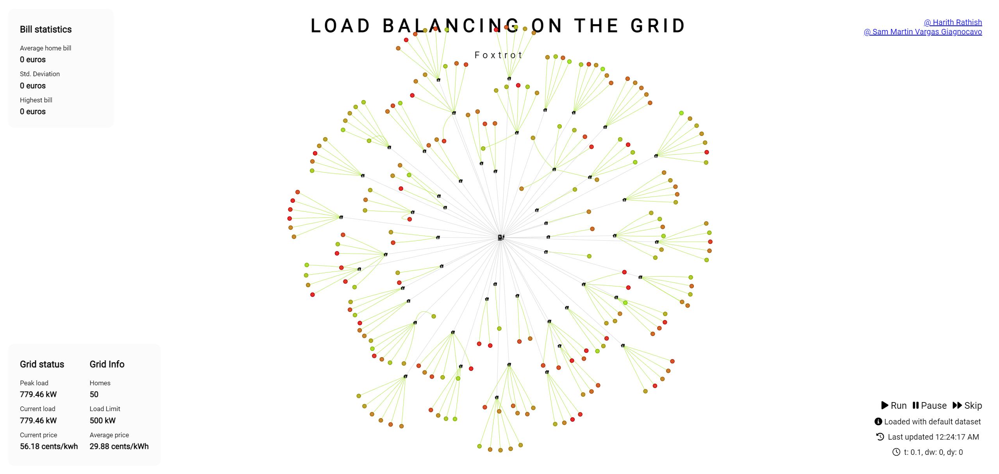

<div id="top"></div>
<!--
*** Thanks for checking out the Best-README-Template. If you have a suggestion
*** that would make this better, please fork the repo and create a pull request
*** or simply open an issue with the tag "enhancement".
*** Don't forget to give the project a star!
*** Thanks again! Now go create something AMAZING! :D
-->


<!-- PROJECT SHIELDS -->
<!--
*** I'm using markdown "reference style" links for readability.
*** Reference links are enclosed in brackets [ ] instead of parentheses ( ).
*** See the bottom of this document for the declaration of the reference variables
*** for contributors-url, forks-url, etc. This is an optional, concise syntax you may use.
*** https://www.markdownguide.org/basic-syntax/#reference-style-links
-->


<!-- PROJECT LOGO -->
<br />
<div align="center">

<h3 align="center">Smart Grid Simulation for chargeable devices</h3>

  <p align="center">
    A multi-agent simulation for chargeable devices and its users connected to a smart electrical grid
    <br />
  </p>
</div>


<!-- TABLE OF CONTENTS -->
<details>
  <summary>Table of Contents</summary>
  <ol>
    <li>
      <a href="#about-the-project">About The Project</a>
      <ul>
        <li><a href="#built-with">Built With</a></li>
      </ul>
    </li>
    <li>
      <ul>
        <li><a href="#prerequisites">Prerequisites</a></li>
        <li><a href="#installation">Installation</a></li>
      </ul>
    </li>
  </ol>
</details>


<!-- ABOUT THE PROJECT -->
## About The Project



This is a project that simulates a smart grid designed for chargeable devices. The simulation runs on Python 3 and there's a JavaScript based front-end to control and monitor the simulation. 

<p align="right">(<a href="#top">back to top</a>)</p>

### Built With

* [Vis.js](https://visjs.org/)
* [Flask](https://flask.palletsprojects.com/en/2.0.x/)

<p align="right">(<a href="#top">back to top</a>)</p>

### Prerequisites

This project uses Python 3.9.9.

### Installation

1. Clone the repo
2. Install Python dependencies
   ```pip install -r requirements.txt```
3. Run
   ```python3 pip```
4. Start the simulation server
   ```python3 sim.py```
5. Open the address ```http://127.0.0.1:5000/``` in a browser
6. Follow the on screen instructions
<p align="right">(<a href="#top">back to top</a>)</p>
